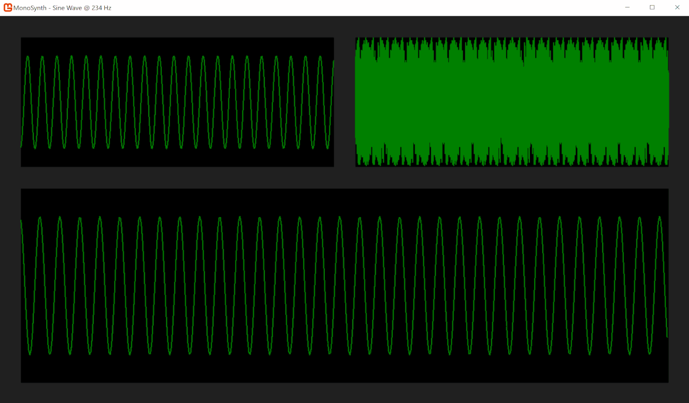

# MonoSynth 
An audio synthesis experiment written in C# using MonoGame.

Use the arrow keys to adjust frequency and amplitude and space bar to change the wave form.

# References
* https://www.david-gouveia.com/creating-a-basic-synth-in-xna-part-i
* https://www.david-gouveia.com/rendering-mathematical-functions-in-xna
